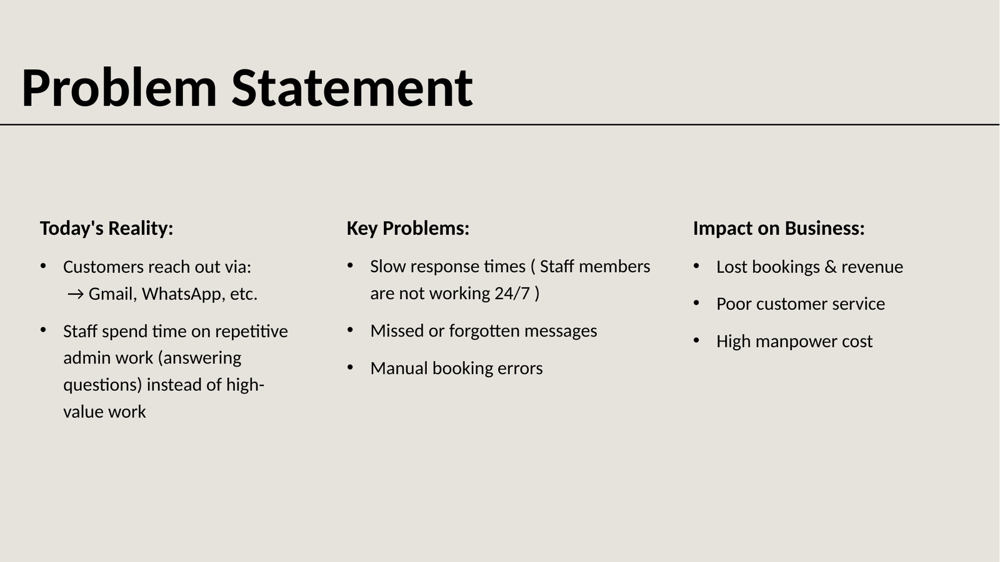
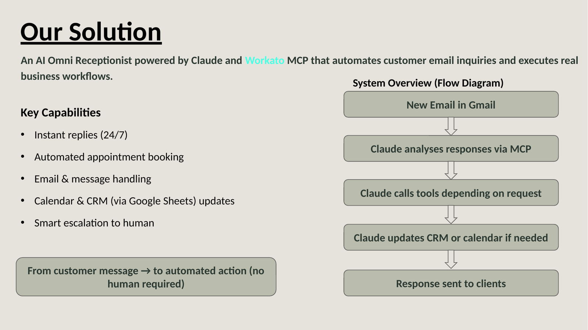
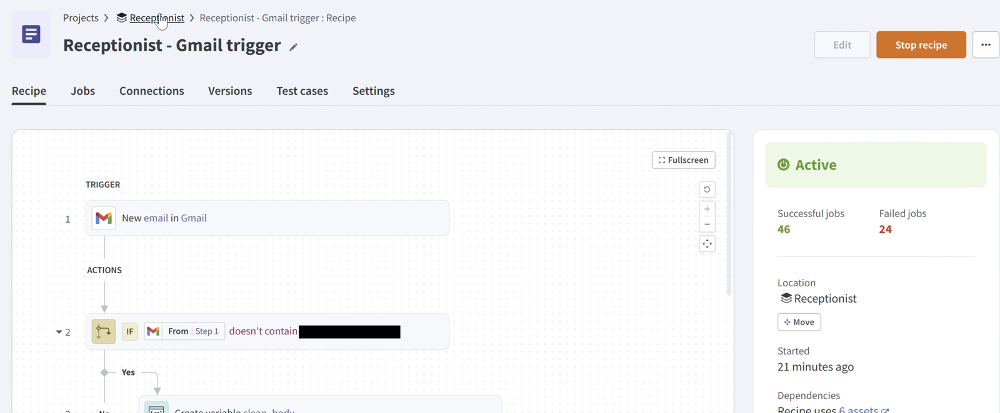
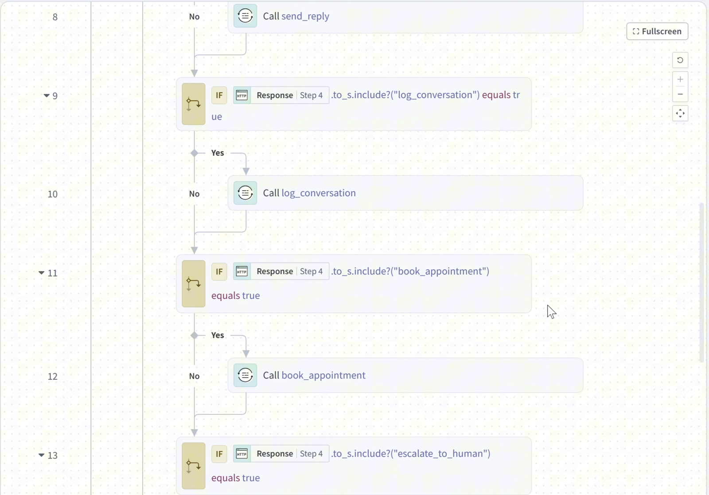
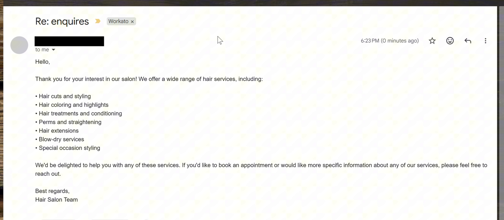
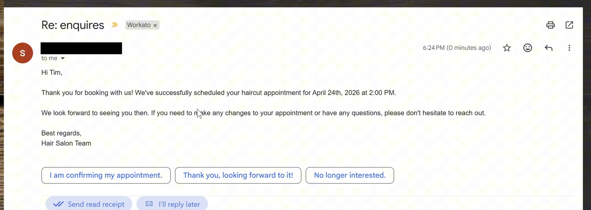
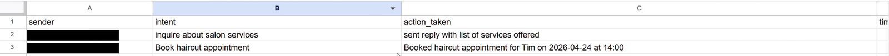
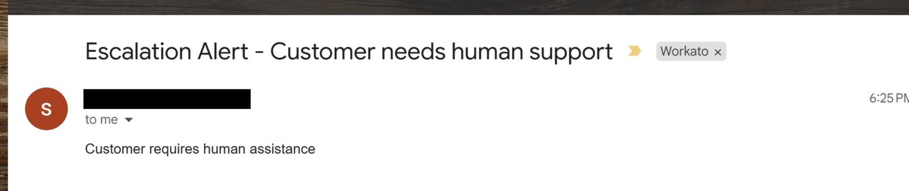
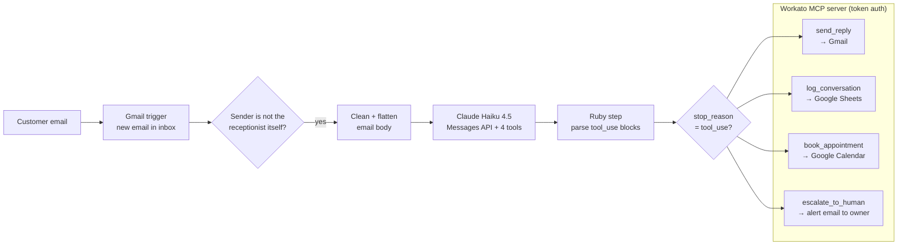

# AI Omnireceptionist

> Built for the NAISC 2026. The screenshots are from a live run before 

An email receptionist for a small service business (a hair salon), built on Workato with Claude Haiku as the reasoning layer. The receptionist reads each inbound email and decides what to do in a single model call. It can:

- reply to the customer with a helpful, fully written email
- book an appointment in Google Calendar when the email has a name, service, date and time
- log every interaction to Google Sheets
- escalate to a human when the customer is upset or the request is too complex

The same four actions are also exposed as a Workato MCP server, so any MCP client (e.g. Claude) can call them directly as tools.

---

Additional info





---

## Example

A Gmail trigger filters out the receptionist's own mail, then the email goes to Claude:



Each tool Claude chooses runs its own callable recipe:



**A customer asks what services the salon offers.** Claude replies:



**The customer asks to book a haircut on 24 April at 2 PM.** Claude confirms, books the slot and logs both conversations:





**The customer asks for a human.** The owner gets an alert:



Email addresses are redacted.

---

## Code



1. **Trigger.** A Gmail trigger fires on every new inbox email. Mail sent by the receptionist inbox is skipped, so it never replies to itself.
2. **Pre-processing.** The sender, subject and plain-text body are flattened into one string. Newlines, quotes and backslashes are removed so the text embeds safely in the JSON request.
3. **Claude call.** The flattened email goes to the Anthropic Messages API (`claude-haiku-4-5`) with a [system prompt](prompts/system-prompt.md) and [four tool definitions](prompts/tools.json). The prompt tells Claude to act only through tools, with no free text: always `send_reply` and `log_conversation`, plus `book_appointment` or `escalate_to_human` when needed.
4. **Parse.** A custom [Ruby step](src/parse_tool_calls.rb) turns Claude's `tool_use` blocks into flat fields. It normalises the booking time to ISO 8601 and sets a one-hour end time.
5. **Execute recipe.** Each tool Claude chose triggers the matching callable recipe. The same recipes are published as MCP tools.

---

## Repository layout

| Path | What it is |
|---|---|
| [`workato/`](workato/) | Sanitized Workato project export. It can be re-imported into Workato. |
| `workato/receptionist_gmail_trigger.recipe.json` | Main orchestrator recipe: trigger → Claude → parse → dispatch |
| `workato/send_reply.recipe.json` | Callable recipe: send an HTML email via Gmail |
| `workato/book_appointment.recipe.json` | Callable recipe: create a Google Calendar event |
| `workato/log_conversation.recipe.json` | Callable recipe: append a row (sender, intent, action) to Google Sheets |
| `workato/escalate_to_human.recipe.json` | Callable recipe: email an alert to the business owner |
| `workato/claude.mcp_server.json` | Exposes the four callable recipes as MCP tools |
| `workato/*.connection.json` | Connection stubs (name + provider only, no credentials) |
| [`prompts/`](prompts/) | System prompt and tool schemas, extracted for readability |
| [`src/parse_tool_calls.rb`](src/parse_tool_calls.rb) | The Ruby parsing step, extracted for readability |
| [`docs/`](docs/) | Pitch slides and screenshots from the live run (email addresses redacted) |
| [`demo/`](demo/) | Runs the Claude step locally against sample emails, without Workato |
| [`scripts/sanitize.py`](scripts/sanitize.py) | Strips personal data from a raw Workato export and audits the result |

---

## Without Workato

The demo sends sample customer emails to Claude using the **exact** prompt, tools and model from the recipe. It prints what the receptionist would do with each one. Nothing is actually emailed, booked or logged.

```bash
pip install -r demo/requirements.txt
export ANTHROPIC_API_KEY=sk-ant-...        # your own key
python3 demo/run_demo.py                   # all samples: booking, question, complaint
python3 demo/run_demo.py --dry-run         # just show the request, no API key needed
```

Example output for the booking email (Claude's wording will vary):

```text
1_booking.txt
  From: meilin.tan@example.com
  Subject: Haircut appointment
------------------------------------------------------------------------
1. send_reply
    Gmail → send reply to meilin.tan@example.com
    Subject: Re: Haircut appointment
    | Hi Mei Lin, ...
2. book_appointment
    Google Calendar → event "Mei Lin Tan - Women's haircut and blow-dry"
    Sat 03 Oct 2026, 14:00 – 15:00
3. log_conversation
    Google Sheets → new row: [meilin.tan@example.com] [Appointment booking] [...]
```

To test your own cases, add `.txt` files to `demo/sample_emails/` in the same format: `From:` and `Subject:` lines, a blank line, then the body.

---

## Running it in Workato

1. **Import.** Zip the contents of `workato/` and import the zip in Workato (*Projects → Import*).
2. **Connect accounts.** Create the connections the recipes expect:
   - **Gmail**: the inbox the receptionist monitors and replies from
   - **Google Calendar**: the calendar appointments are booked into
   - **Google Sheets**: the conversation log
   - **HTTP (Anthropic Claude)**: base URL `https://api.anthropic.com`, with headers `x-api-key: <your key>` and `anthropic-version: 2023-06-01`
3. **Replace the placeholders.**
   - `receptionist-inbox@example.com` in the trigger filter → your receptionist inbox address
   - `owner@example.com` in `escalate_to_human` → the address that should receive escalations
   - `YOUR_GOOGLE_SHEET_ID` in `log_conversation` → your sheet's ID, with a tab named `test` (or change the tab name)
4. **Start** the four callable recipes first, then the Gmail trigger recipe.
5. *(Optional)* In Workato's MCP settings, enable the `claude` MCP server and connect it to an MCP client with the generated token.

---

## Publishing safely

Workato exports never contain credentials, but they can still hold personal email addresses and Google resource IDs. Everything in `workato/` was produced by:

```bash
python3 scripts/sanitize.py path/to/raw-export.zip
```

The script replaces every email address and Google resource ID with a placeholder. It regenerates the readable files in `prompts/` and `src/`, then audits the repo for emails, API keys, bearer tokens and resource IDs. If anything is left, it exits with an error. Raw exports are listed in `.gitignore`.

---

## Tech

Workato (recipes, callable recipes, MCP server) · Anthropic Claude Haiku 4.5 (Messages API, tool use) · Gmail · Google Calendar · Google Sheets · Ruby (Workato custom code)
